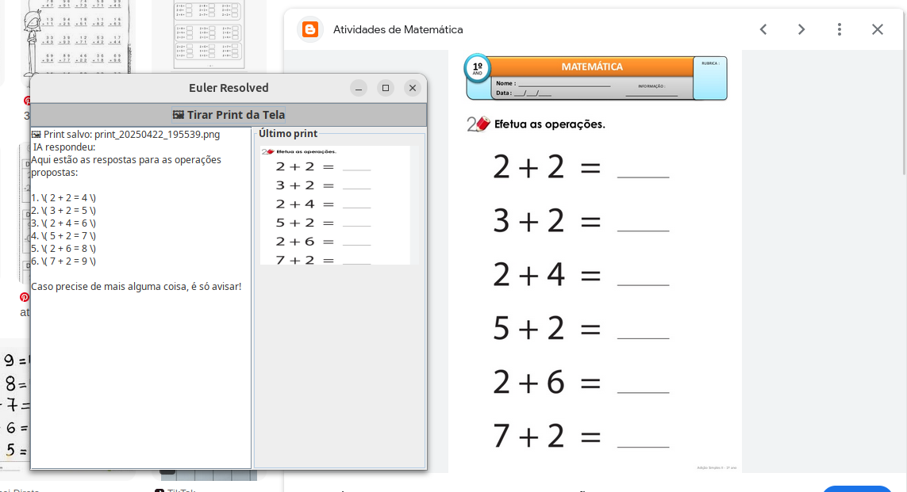

<h1>🖼️ Euler Resolved - Captura de Tela com Inteligência Artificial</h1>

  <strong>Euler Resolved</strong> é uma aplicação em Java com interface gráfica que permite ao usuário selecionar uma área da tela, capturá-la como imagem e enviá-la para uma IA para análise e resposta automática.

<h2>✨ Funcionalidades</h2>
<ul>
  <li>Seleção livre da área da tela para captura</li>
  <li>Miniatura do print exibida na interface</li>
  <li>Envio automático da imagem capturada para uma IA com retorno de resposta</li>
  <li>Atalho com teclado (<code>+</code> e <code>-</code> pressionados juntos) para captura rápida</li>
</ul>

<h2>🛠️ Tecnologias Utilizadas</h2>
<ul>
  <li>Java (versão 17 ou superior)</li>
  <li>Swing para interface gráfica</li>
  <li>Integração via HTTP com API da OpenAI (ou similar)</li>
  <li>Sem dependências externas (100% Java puro)</li>
</ul>

<h2>🚀 Como Executar</h2>
<ol>
  <li>Clone este repositório</li>
  <li>Abra o projeto no IntelliJ ou outro IDE Java</li>
  <li>Execute a classe <code>Main.java</code></li>
  <li>Use o botão ou o atalho para tirar um print e receber resposta da IA</li>
</ol>

<h2>💡 Objetivo do Projeto</h2>

  Desenvolver uma ferramenta simples e funcional que utilize Java puro para capturar imagens da tela e integrar com uma IA visual, unindo automação com reconhecimento inteligente.

